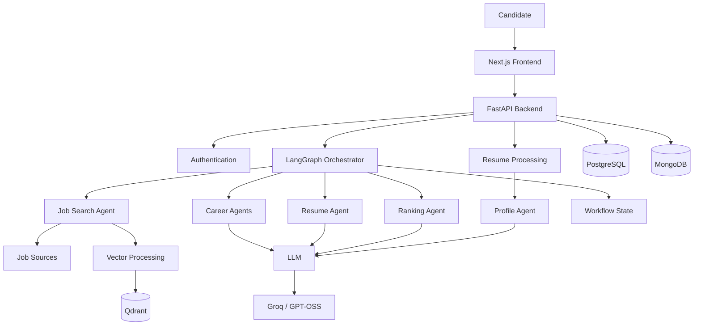

# 🤖 AI Job Agent

### AI-Powered Job Discovery, Matching & Career Automation Platform

> **AI Job Agent is an intelligent career automation platform that transforms a candidate's resume and preferences into a personalized job-discovery workflow using LLMs, semantic vector search, agent orchestration, and modern cloud-native technologies.**

It analyzes a candidate's resume, extracts a structured profile, searches for relevant jobs, filters opportunities based on preferences, performs semantic retrieval using vector search, ranks the most relevant jobs, and generates tailored career assets.

The project combines **Generative AI, Agentic Workflows, Backend Engineering, Full-Stack Development, Vector Databases, and DevOps** into one end-to-end application.

---

## 🚀 Why I Built This

Job searching is often repetitive and fragmented.

A candidate typically has to:

* upload and repeatedly modify a resume
* search multiple job platforms
* filter jobs manually
* compare job descriptions against their skills
* decide which opportunities are actually relevant
* tailor a resume for different positions
* write cover letters
* prepare for interviews separately

I wanted to explore how an **AI-agent architecture** could automate this workflow while still keeping the system modular, explainable, and extensible.

The result is **AI Job Agent** — a system designed around independent agents that collaborate through a LangGraph workflow.

---

# ✨ Core Capabilities

## 🧠 AI Resume Intelligence

The platform accepts a candidate resume and uses an LLM-powered profile extraction workflow to identify structured information such as:

* candidate name
* professional role
* skills
* technical experience
* career preferences
* relevant profile information

This structured profile becomes the foundation for downstream job matching.

---

## 🔎 Intelligent Job Search

The system can search multiple job sources and collect available opportunities based on:

* target role
* location
* experience level
* preferred sources
* other user-defined preferences

The application normalizes collected jobs into a common structure before further processing.

---

## 🧬 Semantic Job Matching

Instead of relying only on keyword matching, the project uses **Qdrant vector search** to retrieve semantically relevant jobs.

The workflow is approximately:

```text
Resume
   ↓
Candidate Profile
   ↓
Embedding / Vector Representation
   ↓
Qdrant
   ↓
Semantic Job Retrieval
   ↓
Relevant Jobs
```

This makes it possible to identify jobs that are conceptually related to the candidate's experience even when exact keywords differ.

---

## 🎯 AI-Powered Job Ranking

Retrieved jobs are passed through a ranking stage that evaluates relevance against the candidate profile.

The goal is to move from:

> "Here are 30 jobs"

to:

> "These are the opportunities that best match your profile and preferences."

This ranking layer can be extended with additional signals such as:

* technical skill overlap
* seniority compatibility
* location
* cloud/platform experience
* role similarity
* domain relevance

---

## 📝 Tailored Resume Generation

The Resume Agent generates a job-specific resume strategy using:

* candidate profile
* target job
* relevant experience
* existing technical skills

The generation prompt explicitly instructs the model to **avoid inventing experience** and work only from the candidate's supplied profile.

The current workflow uses **GPT-OSS-120B through Groq inference** for LLM-powered generation.

---

## 💼 Career Automation

The architecture is designed to support multiple career-related AI capabilities, including:

```text
Resume Analysis
       ↓
Job Discovery
       ↓
Semantic Matching
       ↓
Job Ranking
       ↓
Tailored Resume
       ↓
Cover Letter
       ↓
Interview Preparation
```

This turns the project from a simple job scraper into a broader **AI career automation platform**.

---

# 🏗️ System Architecture



---

# 🧩 Agentic Workflow

The AI workflow is orchestrated using **LangGraph**.

Each stage has a dedicated responsibility instead of putting the entire application inside one large AI prompt.

### Current conceptual flow

```text
                    ┌──────────────────┐
                    │   Resume Upload  │
                    └────────┬─────────┘
                             ↓
                    ┌──────────────────┐
                    │  Profile Agent   │
                    └────────┬─────────┘
                             ↓
                    ┌──────────────────┐
                    │  Search Agent    │
                    └────────┬─────────┘
                             ↓
                    ┌──────────────────┐
                    │ Vector Retrieval │
                    │     Qdrant       │
                    └────────┬─────────┘
                             ↓
                    ┌──────────────────┐
                    │  Ranking Agent   │
                    └────────┬─────────┘
                             ↓
                    ┌──────────────────┐
                    │  Resume Agent    │
                    └────────┬─────────┘
                             ↓
                    ┌──────────────────┐
                    │ Career Results   │
                    └──────────────────┘
```

The modular design makes individual agents easier to test, replace, or extend.

---

# 🛠️ Technology Stack

## Frontend

* **Next.js 16**
* **React**
* **TypeScript**
* **Tailwind CSS**
* Next.js App Router
* Client-side API integration

## Backend

* **Python**
* **FastAPI**
* REST APIs
* Authentication
* Resume processing
* Workflow orchestration

## AI / LLM

* **LangGraph**
* **LangChain**
* **Groq**
* **GPT-OSS-120B**
* LLM-based profile extraction
* AI job ranking
* AI resume generation

## Data Layer

* **PostgreSQL** — structured application data
* **MongoDB** — document/workflow-oriented data
* **Qdrant** — semantic vector search

## DevOps / Infrastructure

* **Docker**
* **Docker Compose**
* AWS EC2
* Containerized services
* Environment-based configuration
* Health checks and service orchestration

---

# 🔐 Authentication

The platform includes application-level authentication and protected workflow access.

Current authentication flow:

```text
User
 ↓
Signup / Login
 ↓
Authenticated Session
 ↓
Resume Upload
 ↓
AI Workflow
 ↓
Personalized Results
```

Authentication APIs include:

```text
POST /auth/signup
POST /auth/login
GET  /auth/me
```

---

# 📄 Resume Processing

Users can upload a PDF resume through the application.

The backend extracts text from the uploaded document and passes the extracted content into the profile intelligence pipeline.

Example:

```text
PDF Resume
    ↓
Text Extraction
    ↓
Resume Content
    ↓
Profile Agent
    ↓
Structured Candidate Profile
```

This avoids requiring the user to manually re-enter their professional information.

---

# 🔌 Backend API

Core API endpoints include:

```text
GET  /health

POST /auth/signup
POST /auth/login
GET  /auth/me

POST /resume/upload

POST /search/jobs

POST /orchestrator/start
```

The backend is exposed through FastAPI and can be accessed directly through its interactive API documentation.

For local development:

```text
http://localhost:8000/docs
```

---

# 📁 Project Structure

```text
ai-job-agent/
│
├── agents/
│   ├── profile_agent.py
│   ├── search_agent.py
│   ├── ranking_agent.py
│   ├── resume_agent.py
│   └── ...
│
├── api/
│   ├── main.py
│   └── routes/
│       ├── auth.py
│       ├── resume.py
│       ├── search.py
│       └── orchestrator.py
│
├── config/
│   └── llm.py
│
├── workflows/
│   └── graph.py
│
├── tools/
│   └── job_search.py
│
├── frontend/
│   ├── app/
│   ├── components/
│   ├── lib/
│   ├── public/
│   └── package.json
│
├── k8s/
│   └── ...
│
├── docker-compose.yml
├── Dockerfile
├── requirements.txt
└── README.md
```

---

# ⚙️ Running the Backend

The backend can be started using Docker Compose.

```bash
cd ai-job-agent

docker compose up -d
```

Check services:

```bash
docker compose ps
```

Check API logs:

```bash
docker compose logs -f api
```

Health check:

```bash
curl http://localhost:8000/health
```

---

# ⚛️ Running the Frontend

The Next.js frontend can also be run directly with npm.

```bash
cd frontend

npm install
npm run dev
```

Application:

```text
http://localhost:3000
```

For a production build:

```bash
npm run build
npm start
```

---

# 🔐 Environment Configuration

Create an environment file for local development.

Example:

```env
GROQ_API_KEY=your_groq_api_key

DATABASE_URL=your_postgresql_url

MONGODB_URL=your_mongodb_url

QDRANT_URL=your_qdrant_url

NEXT_PUBLIC_API_URL=http://localhost:8000
```

Never commit secrets to Git.

Recommended:

```text
.env
.env.local
.env.production
```

should be excluded through `.gitignore`.

---

# 🧪 Example Workflow

A typical user session looks like:

```text
1. User creates an account
          ↓
2. User uploads resume
          ↓
3. Resume text is extracted
          ↓
4. Profile Agent analyzes candidate
          ↓
5. User preferences are applied
          ↓
6. Job sources are queried
          ↓
7. Jobs are indexed for semantic retrieval
          ↓
8. Qdrant retrieves relevant jobs
          ↓
9. Ranking Agent evaluates relevance
          ↓
10. Top opportunities are selected
          ↓
11. Resume Agent generates tailored output
          ↓
12. Results are returned to the frontend
```

---

# 🧠 Engineering Decisions

## Why FastAPI?

FastAPI provides:

* high-performance APIs
* automatic OpenAPI documentation
* Python-native AI integration
* clean dependency injection
* simple service decomposition

It also fits well with the Python ecosystem used for LLMs, vector databases, and AI orchestration.

---

## Why LangGraph?

A traditional application could place all AI functionality into a single request handler.

Instead, this project uses a graph-based architecture so the workflow can be broken into specialized stages.

Advantages:

* modular AI agents
* explicit workflow transitions
* easier debugging
* easier future branching
* reusable agent components
* better separation of responsibilities

---

## Why Qdrant?

Keyword search alone can miss semantically relevant opportunities.

Qdrant provides vector similarity search that can be used to compare:

```text
Candidate Profile
        ↕
Semantic Representation
        ↕
Job Description
```

This enables the application to retrieve jobs based on meaning and context rather than only exact text matches.

---

## Why PostgreSQL + MongoDB + Qdrant?

Each database is used according to the type of information it handles best.

```text
PostgreSQL
    ↓
Structured relational data

MongoDB
    ↓
Flexible documents / workflow-oriented data

Qdrant
    ↓
Embeddings / semantic retrieval
```

This demonstrates a polyglot persistence architecture rather than forcing every workload into one database technology.

---

# 🐳 Containerized Architecture

The application is designed to run as multiple services:

```text
                Docker Compose
                     │
        ┌────────────┼────────────┐
        │            │            │
        ↓            ↓            ↓
    Frontend        API       PostgreSQL
     :3000          :8000
        │            │
        │       ┌────┴────┐
        │       ↓         ↓
        │    MongoDB    Qdrant
        │
        └──────────────→ Browser
```

This makes local development and deployment more consistent across environments.

---

# ☁️ AWS Deployment

The project has been developed with deployment on AWS in mind and has been run in a containerized EC2 environment.

The architecture can be extended toward:

```text
                    AWS
                     │
              ┌──────┴──────┐
              │     EC2     │
              │ Docker Host │
              └──────┬──────┘
                     │
         ┌───────────┼───────────┐
         ↓           ↓           ↓
     Frontend       API       Databases
```

The project can further evolve toward:

```text
AWS
 │
 ├── EKS
 ├── ECR
 ├── RDS PostgreSQL
 ├── Managed MongoDB
 ├── Qdrant
 ├── CloudWatch
 └── CI/CD
```

---

# 🔒 Security Considerations

Security has been considered from the application and infrastructure perspective.

Current practices include:

* environment-based secret management
* authenticated API access
* separation of frontend and backend
* containerized services
* controlled database exposure
* avoiding credentials in source code
* explicit API configuration
* protected application resources

Future improvements include:

* centralized secret management
* OAuth integration
* RBAC
* API rate limiting
* stronger audit logging
* automated dependency/security scanning

---

# 📊 Observability & Troubleshooting

The application uses container logs and service health checks for troubleshooting.

Example:

```bash
docker compose ps
docker compose logs -f api
docker compose logs -f frontend
```

Backend health:

```bash
curl http://localhost:8000/health
```

This allows individual services to be diagnosed without stopping the full application.

---

# 🧪 What I Learned Building This

This project was intentionally built as more than an AI demo.

It required working across several engineering layers:

```text
Frontend Development
        ↓
REST API Design
        ↓
Authentication
        ↓
Resume Processing
        ↓
LLM Integration
        ↓
Agent Orchestration
        ↓
Vector Search
        ↓
Database Design
        ↓
Docker
        ↓
AWS Deployment
        ↓
Debugging & Operations
```

The most valuable part of the project has been learning how to connect these technologies into one working system rather than treating them as isolated components.

---

# 🔮 Roadmap

The platform is designed to evolve into a larger AI career platform.

Planned improvements include:

### AI

* multi-model routing
* improved structured LLM outputs
* stronger job relevance scoring
* personalized application strategies
* interview simulation
* skill-gap analysis
* application prioritization

### Job Intelligence

* additional job sources
* duplicate detection
* company intelligence
* salary extraction
* job freshness tracking
* application status tracking

### Platform

* Google OAuth
* refresh-token authentication
* user preference management
* persistent workflow history
* notification system
* personalized dashboards

### DevOps / Cloud

* GitHub Actions CI/CD
* Docker image publishing
* Kubernetes deployment
* Helm charts
* ArgoCD
* monitoring with Prometheus/Grafana
* centralized logging
* security scanning

---

# 🎯 Recruiter / Engineering Perspective

This project demonstrates practical experience across multiple engineering domains:

| Area            | Demonstrated Technologies                           |
| --------------- | --------------------------------------------------- |
| Backend         | Python, FastAPI, REST APIs                          |
| Frontend        | Next.js, React, TypeScript                          |
| AI              | LLMs, LangChain, LangGraph                          |
| AI Agents       | Profile, Search, Ranking, Resume workflows          |
| Vector Search   | Qdrant                                              |
| Databases       | PostgreSQL, MongoDB                                 |
| Containers      | Docker, Docker Compose                              |
| Cloud           | AWS EC2                                             |
| Authentication  | Signup, Login, Protected APIs                       |
| DevOps          | Containerized deployment, environment configuration |
| Problem Solving | Debugging distributed application workflows         |

---

# 💡 What Makes This Project Different

AI Job Agent is not simply an LLM chatbot.

It combines:

```text
Generative AI
       +
Agentic Workflows
       +
Semantic Search
       +
Backend Engineering
       +
Full-Stack Development
       +
Databases
       +
Cloud Infrastructure
       +
DevOps
```

The goal is to demonstrate how AI can be integrated into a **real application architecture**, with dedicated services, data layers, workflow orchestration, authentication, and deployment infrastructure.

---

# 🖥️ Application Screens

Recommended screenshots to add to this README:

```text
/screenshots/
├── login.png
├── dashboard.png
├── resume-upload.png
├── job-search.png
├── job-results.png
├── workflow.png
└── tailored-resume.png
```

Example markdown:

```md
## 🖥️ Application Preview


```

A good README screenshot sequence should tell the product story:

**Login → Resume Upload → AI Workflow → Job Results → Tailored Resume**

---

# 🏆 Project Highlights

* Built an end-to-end **AI-powered job automation platform**
* Implemented modular AI workflows using **LangGraph**
* Integrated **LLM-powered profile extraction and resume generation**
* Implemented **semantic job retrieval with Qdrant**
* Built a **FastAPI backend** with authentication and workflow APIs
* Developed a modern **Next.js frontend**
* Integrated **PostgreSQL, MongoDB, and Qdrant**
* Containerized the application using **Docker Compose**
* Deployed and operated the application in an **AWS EC2 environment**
* Designed the architecture for future **Kubernetes and CI/CD** deployment

---

# 👨‍💻 Author

**Vikrant Kumar**

DevOps & Cloud Engineer | AI & Platform Engineering

Focused on:

```text
AWS
Kubernetes
Docker
Terraform
CI/CD
Python
FastAPI
Generative AI
LangGraph
Cloud Infrastructure
DevSecOps
```

---

# ⭐ Project Vision

> **AI Job Agent is an engineering experiment in building an intelligent, modular, and cloud-ready career automation platform where AI agents work together to reduce repetitive job-search and application tasks.**

The long-term vision is to evolve the system from a job discovery tool into a **personal AI career platform** capable of understanding a candidate's skills, discovering relevant opportunities, preparing applications, and continuously helping users improve their career strategy.

---

## 📌 Status

**Active Development**

The core application flow is functional, including authentication, resume upload, AI profile extraction, job discovery, vector retrieval, ranking, and AI-powered resume generation. The architecture is intentionally modular so additional agents, job sources, infrastructure, and automation capabilities can be added incrementally.
